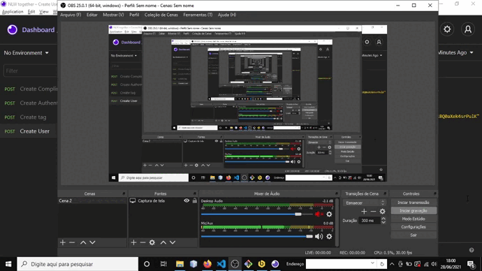

# Aplicação back-end que autentica, cadastra tags, respostas e usuários
* Tecnologias usadas, aperfeiçoadas e aprendidas: 

* TypeScript
* NodeJS
* JSON Web Tokens
* SQLite
* Express
* Insominia e Beekeeper para simular requisições e banco de dados

